<p align="center">
  <picture>
    <source media="(prefers-color-scheme: dark)" srcset=".github/assets/header.svg" />
    <source media="(prefers-color-scheme: light)" srcset=".github/assets/header.svg" />
    
  </picture>
</p>

<p align="center">
  <strong>A fast, GPU-rendered, telemetry-free code &amp; text editor. Present day, present text.</strong>
</p>

<p align="center">
  <a href="#what-is-this">About</a> &nbsp;&middot;&nbsp;
  <a href="#installation">Install</a> &nbsp;&middot;&nbsp;
  <a href="#quick-start">Quick Start</a> &nbsp;&middot;&nbsp;
  <a href="#capabilities">Capabilities</a> &nbsp;&middot;&nbsp;
  <a href="#the-network">Network</a> &nbsp;&middot;&nbsp;
  <a href="#contributing">Contributing</a>
</p>

<p align="center">
  
  
  
  
  
</p>

---

## What is this?

SCR1B3 (pronounced "scribe") is a code and text editor built in Rust for people who want a fast, native editor that respects them. It opens multi-gigabyte files without freezing, themes all the way down, and never phones home.

The text engine is a rope buffer, so edits on huge documents stay in the single-digit-microsecond range, and memory-mapped read-only browsing means files far larger than RAM open instantly. Syntax highlighting comes from syntect with 100+ bundled languages and no per-language build step. Tree-sitter handles structural awareness on top. Everything — appearance, fonts, effects, behavior, themes — is driven by a single live-reloading TOML config. No webview, no account, no bloat.

The name is a nod to *Serial Experiments Lain*. Good tools don't call attention to themselves. They just work when you reach for them — present day, present text.

## Installation

### Windows

Download `scr1b3-x86_64-pc-windows-msvc.msi` from the [Releases](https://github.com/46b-ETYKiAL/Itasha.Corp_S4F3-SCR1B3/releases) page and double-click it — the installer adds a Start Menu shortcut and an optional PATH entry. Or via a package manager:

```powershell
# winget (when published)
winget install ItashaCorp.SCR1B3

# or grab the portable .exe from the Releases page (self-updating)
```

### macOS

```bash
# Homebrew cask (when published)
brew install --cask scr1b3

# or download the .dmg from the Releases page
```

### Linux

```bash
# AppImage — download, mark executable, run
chmod +x SCR1B3-x86_64.AppImage
./SCR1B3-x86_64.AppImage

# Debian / Ubuntu
sudo dpkg -i scr1b3_<version>_amd64.deb
```

### One-line installer

```bash
curl -fsSL https://raw.githubusercontent.com/46b-ETYKiAL/Itasha.Corp_S4F3-SCR1B3/master/scripts/install.sh | sh
```

### Build from source

Requires a [Rust toolchain](https://rustup.rs/) (the pinned version is in `rust-toolchain.toml`).

```bash
git clone https://github.com/46b-ETYKiAL/Itasha.Corp_S4F3-SCR1B3
cd Itasha.Corp_S4F3-SCR1B3
cargo build --release
# binary at target/release/scr1b3
```

## Quick Start

Open a file directly from the command line:

```bash
scr1b3 path/to/file.rs
```

Or launch SCR1B3 and open files from the editor. On first run it writes nothing outside its own config directory; a missing config uses built-in defaults, and a malformed one falls back to defaults and surfaces the error in-app — the editor never refuses to start.

```
┌──────────────────────────────────────────┐
│  SYSTEM NOTICE                           │
│  ──────────────────────────────────────  │
│  NODE TYPE : EDITOR                      │
│  STATUS    : ACTIVE                      │
│  TELEMETRY : NONE                        │
└──────────────────────────────────────────┘
```

## Capabilities

- **Large files without the freeze** — a rope buffer plus `mmap` read-only browse open multi-GB logs and files that defeat the 2 GB cap and 4×-RAM blowups of legacy editors, and stay responsive while you scroll.
- **GPU-rendered** — smooth scrolling and an optional CRT / scanline / phosphor post-process shader (off by default, toggleable, respects reduced-motion).
- **100+ languages** — syntect-backed syntax highlighting out of the box; standard TextMate / Sublime syntaxes work unchanged, with a native tree-sitter grammar (Rust today) for structure-aware highlighting and folding.
- **Power editing surfaces** — split view over a shared buffer, a document minimap with click-to-jump, brace-aware code folding, and an identifier completion popup (Ctrl/Cmd+Space) — all toggleable from the View menu.
- **Telemetry-free by default** — no account, no analytics, no usage beacons. Your file contents never leave your device.
- **Deep theming** — live-reload Helix-style `[palette]` / `[ui]` / `[syntax]` TOML themes, including glass / transparency effects; ship your own without recompiling. Broken themes fall back to the compiled-in default, so the editor never blanks.
- **LSP diagnostics** — language-server integration surfaces errors, warnings, and hints inline.
- **Modern editing** — multi-tab, find / replace with full regex and capture-group replacement, per-line syntax spans, and encoding + EOL detection that round-trips files unmodified.
- **Plugins &amp; mods** — a capability-consent user plugin system scripted in [Rhai](https://rhai.rs) (pure-Rust, sandboxed by construction — no filesystem or network access, bounded by an operation count and a wall-clock deadline so a runaway script can't hang the editor).
- **Offline spellcheck** — fully offline, code-aware (comments / strings), off by default.
- **Signed auto-update** — telemetry-free version check against the public GitHub Releases API only, cryptographically verified before swap, fully opt-out.
- **Tiny binary** — `strip`ped, LTO release build. No Chromium, no system webview, hundreds of MB lighter than Electron editors.

<details>
<summary><strong>Technical Context</strong></summary>

SCR1B3 is a Cargo workspace: `scribe-core` holds the rope-backed text engine, encoding / EOL detection, syntect + tree-sitter highlighting, and the offline spellchecker; `scribe-render` maps themes and the CRT post-process shader to the GPU surface; `scribe-app` is the binary that wires them into a frameless, native-feel window.

The text engine uses a rope so insertions and deletions cost O(log n) regardless of document size. Read-only browsing of very large files is backed by `mmap`, so the OS pages content on demand rather than loading the whole file into memory. Highlighting layers syntect (TextMate / Sublime grammars, 100+ languages bundled) with tree-sitter for structure-aware features.

Configuration is a single TOML file that live-reloads on change. Themes use a three-namespace schema (`[palette]` / `[ui]` / `[syntax]`) with palette-name references and `#RRGGBB` / `#RRGGBBAA` literals; the default theme is `itasha-void` — void black, signal cyan, status green. The plugin system is capability-consented: plugins declare the capabilities they need and you approve them. Scripts run in an embedded [Rhai](https://rhai.rs) interpreter that is sandboxed by construction (no ambient filesystem or network access) and bounded by both an operation-count ceiling and a wall-clock deadline, so a misbehaving or runaway plugin cannot hang or compromise the editor.

</details>

## The Network

| Node | Role |
|------|------|
| [S4F3-3TCH](https://github.com/46b-ETYKiAL/S4F3-3TCH) | ComfyUI custom nodes |
| [S4F3-R3L4Y](https://github.com/46b-ETYKiAL/S4F3-R3L4Y) | MCP server infrastructure |

## Configuration

SCR1B3 reads a single live-reloading TOML file from your OS config directory. A missing file uses built-in defaults; a malformed file falls back to defaults and surfaces the error in-app. Every key — `[editor]`, `[appearance]`, `[fonts]`, `[effects]`, `[updates]`, `[spellcheck]`, `[plugins]` — is documented with types, defaults, and a full example in **[CONFIG.md](CONFIG.md)**.

## Theming

Themes use a Helix-style three-namespace TOML schema (`[palette]` / `[ui]` / `[syntax]`) with palette-name references and `#RRGGBB` / `#RRGGBBAA` literals. The default theme is `itasha-void`. Write your own and drop it in the themes directory; broken themes fall back to the compiled-in default. CRT effect toggles and intensities live in `[effects]`. Full guide: **[THEMING.md](THEMING.md)**.

## Plugins

Beyond config and themes, SCR1B3 supports a user plugin / mod system with a capability-consent model: a low-barrier Lua easy-mode (no build step) and a WASM power track for sandboxed compiled extensions. Plugins declare the capabilities they need and you approve them. See **[PLUGINS.md](PLUGINS.md)**.

## Tech Stack

| Layer | Technology |
|-------|------------|
| Core engine | Rust, ropey |
| Highlighting | syntect, tree-sitter |
| Rendering | GPU surface + WGSL CRT shader |
| Config / themes | TOML (live-reload) |
| Plugins | Lua, WASM |
| License | MIT OR Apache-2.0 |

## Status


> [!TIP]
> This project is open source under the MIT OR Apache-2.0 license. Contributions welcome.

## Contributing

Contributions are welcome. SCR1B3 is a Cargo workspace (`scribe-core` / `scribe-render` / `scribe-app`). Build with `cargo build`, test with `cargo nextest run`, and pass `cargo fmt --check` + `cargo clippy -D warnings` before opening a PR. Please read **[CONTRIBUTING.md](CONTRIBUTING.md)** and the [Architecture Decision Records](docs/adr/), and review our **[Code of Conduct](CODE_OF_CONDUCT.md)** before participating.

Found a security issue? Please follow the disclosure process in **[SECURITY.md](SECURITY.md)** — do not open a public issue for vulnerabilities.

## License

SCR1B3 is dual-licensed under either of:

- **MIT License** ([LICENSE-MIT](LICENSE-MIT))
- **Apache License, Version 2.0** ([LICENSE-APACHE](LICENSE-APACHE))

at your option. Unless you explicitly state otherwise, any contribution intentionally submitted for inclusion in this project by you, as defined in the Apache-2.0 license, shall be dual-licensed as above, without any additional terms or conditions.

<p align="center">
  <picture>
    <source media="(prefers-color-scheme: dark)" srcset=".github/assets/footer.svg" />
    <source media="(prefers-color-scheme: light)" srcset=".github/assets/footer.svg" />
    
  </picture>
</p>
