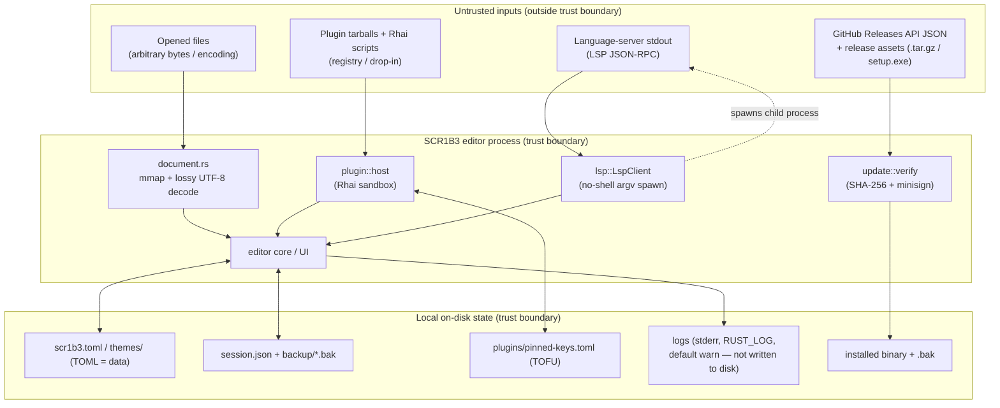

# SCR1B3 Threat Model (STRIDE)

This document is the structured threat model for SCR1B3. It complements
[`SECURITY.md`](../SECURITY.md) (the security *posture* and supply-chain controls) and
[`PRIVACY.md`](../PRIVACY.md) (the telemetry-free network surface). Where those documents
describe *what we do*, this one names *what we defend against* and maps each threat to the
real mechanism in the codebase that mitigates it — or marks it as an accepted residual risk.

## 1. Scope and assumptions

SCR1B3 is a **single-user, local-first, telemetry-free desktop code editor**. The threat
model is grounded in that reality:

- The user **trusts their own machine and their own user account.** The local OS, the
  user's other processes, and the user's filesystem are assumed not hostile. We do not
  defend a host that is already fully compromised.
- The editor stores everything **locally only** (config, themes, session snapshots,
  unsaved-buffer backups, logs — see PRIVACY.md § "Local state"). Nothing is transmitted
  without your explicit consent.
- There are **two** outbound network surfaces (PRIVACY.md): (1) the GitHub Releases update
  check (`crates/scribe-core/src/update/net.rs`), default `notify`, fully controllable via
  `[updates] mode` (`off` / `notify` / `manual` / `auto`); and (2) the **opt-in, default-OFF**
  W1TN3SS crash/error reporting stream (`crates/scribe-app/src/reporting.rs`), which
  transmits nothing unless you turn it on and consent per-report. With `[updates] mode = "off"`
  and reporting left off (the default), SCR1B3 makes zero outbound connections.

Within that scope, the threats we actively defend are:

1. A **malicious file** the user opens or browses.
2. A **malicious plugin** (Rhai script or registry tarball).
3. A **compromised or MITM'd update channel** (the GitHub Releases API / asset CDN).
4. A **hostile language server** (a child LSP process emitting malformed or abusive output).
5. **Recovery of local state** by a different local user on a shared machine.

## 2. Data-flow diagram and trust boundaries

The editor process is the single trust boundary. Everything crossing an arrow *into* it
from the **Untrusted** subgraph is attacker-influenceable and must be validated at the
crossing point. Local on-disk state is trusted-at-rest but protected against another local
user by OS file permissions only (see boundary (e)).

## 3. STRIDE per trust boundary

### (a) Auto-update channel — `crates/scribe-core/src/update/`

| STRIDE | Threat | Mitigation |
|---|---|---|
| **Spoofing** | An attacker serves a forged "latest release" / forged binary from a MITM position or a compromised mirror. | **minisign (ed25519) signature** verified against `EMBEDDED_PUBLIC_KEY` (`verify.rs`) — the public key is compiled into the binary; only the holder of the CI-secret private key can produce an accepted signature. `verify_artifact` runs SHA-256 **then** minisign and **fails closed**; a verify failure wipes the staging dir and never returns the binary (`download_verify_extract`). |
| **Tampering** | The download is corrupted or modified in flight. | **SHA-256 checksum** (`verify_checksum`) from the `.sha256` sidecar is checked first (friendly "corrupted" path), then the signature. A decompression-bomb / disk-fill archive is bounded by `MAX_EXTRACTED_BINARY_BYTES` (512 MiB) and **non-regular tar entries (symlink/hardlink/dir) are rejected** — the TARmageddon / zip-slip class is closed even on an already-signature-valid archive. |
| **Repudiation** | Cannot prove which build produced an artifact. | **SLSA build-provenance attestation** (GitHub OIDC + Sigstore) is additive to minisign — minisign attests author, provenance attests build (see SECURITY.md § Supply chain). |
| **Info disclosure** | The update check leaks user identity / telemetry. | The request is an **unauthenticated GET** with `User-Agent: scr1b3-updater/<version>` only — no install-id, token, or fingerprint (`net.rs` `USER_AGENT`). Default mode is `notify` (a single startup version-check); `manual` and `off` remove the startup call. |
| **DoS** | A false "up to date" hides a security fix; rate-limiting blocks checks. | `select_best` picks the **highest semver across the full release list** (not GitHub's mutable, cacheable `/releases/latest`), sends `Cache-Control: no-cache` + a cache-buster, and uses a **tri-state outcome** (`Available` / `UpToDate` / `NewerButNoAsset`) so a missing platform asset never reads as "up to date". A 403/429 is surfaced distinctly as a rate-limit, never folded into "up to date" (`map_github_error`). |
| **Elevation** | The updater gains privilege it shouldn't. | The updater runs with **the user's permissions, no setuid** (SECURITY.md). For a Program-Files install, the self-elevating `setup.exe` is offered only when its full verifiable triple (`.minisig` + `.sha256`) is present (`find_installer`, fail-closed); UAC is the OS's consent gate. A prior binary is retained (`apply.rs install_with_backup`) for one-step rollback. |

### (b) Plugin system — `crates/scribe-core/src/plugin/` + `scribe-app/src/plugin_manager.rs`

| STRIDE | Threat | Mitigation |
|---|---|---|
| **Spoofing** | An attacker publishes a plugin update under a hijacked author identity ("author takeover"). | **TOFU author-key pinning** (`pinned_keys.rs`): the first install pins `author_pubkey` in `plugins/pinned-keys.toml`; a later install with a different key returns `PinOutcome::Mismatch` and the UI demands explicit consent — **silent key rotation is refused** (same discipline as SSH `known_hosts` / OpenBSD signify). |
| **Tampering** | A plugin tarball or entry script is modified after publication. | **`verify_plugin_tarball`** (`integrity.rs`) recomputes SHA-256 over the on-the-wire bytes and verifies a minisign signature — the **same `update::verify` code path** as the updater. In default (unsigned) mode, **trust-on-first-use by entry-script SHA-256** (`entry_is_trusted`) holds back any brand-new *or silently modified* script until the user re-approves. |
| **Repudiation** | No record of which key/script was approved. | `pinned-keys.toml` records `author_pubkey` + `first_pinned_utc` + `last_verified_utc`; `replace_with_consent` preserves `first_pinned_utc` for the audit trail. |
| **Info disclosure** | A plugin exfiltrates buffer contents or reads arbitrary files. | The Rhai host exposes **only** `buffer_text` / `set_buffer_text` / `notify` / `log` / command+hook registration (`host.rs register_host_fns`). There is **no ambient filesystem, network, or process capability** — privileged `Capability` variants (`FilesystemRead/Write`, `Network`, `Process`) exist in the manifest model but are **not exposed to v1 scripts**. |
| **DoS** | A runaway/hostile script hangs or OOMs the editor. | Rhai engine caps: `max_operations` 5M, `max_call_levels` 64, `max_string_size` 10 MiB, `max_array_size` 1M, `max_map_size` 1M, `max_modules` 0, `max_expr_depths` (32,32), plus a **2 s wall-clock deadline** via `on_progress`. A poisoned mutex is recovered (`unwrap_or_else(into_inner)`) so one bad plugin can't abort the whole process. |
| **Elevation** | A script escapes the sandbox via `eval` / module loading. | `eval` and `import` are **removed from the parser** (`disable_symbol`) — a script using them **fails to compile**, strictly stronger than a runtime trap — backed by a `DummyModuleResolver`. A future-API plugin is gated by `api_version` and `min_app_version` checks (`is_compatible` / `is_app_version_ok`, fail-closed on parse error). |

### (c) Language-server (LSP) — `crates/scribe-core/src/lsp/`

| STRIDE | Threat | Mitigation |
|---|---|---|
| **Spoofing / Elevation** | A config-injected command string is reinterpreted by a shell (e.g. Windows `.bat` argument splitting, CVE-2024-24576 "BatBadBut"). | The server is spawned with `std::process::Command::new(cmd).args(&cfg.args)` — **argv array, no shell** (`LspClient::spawn`). The MSRV pin (`rust-version = 1.92`, above the 1.77.2 floor) makes Windows `.bat`/`.cmd` arg-escaping unconditional. The server runs **under the user's identity**, no elevation. |
| **Tampering** | Hostile LSP output corrupts editor state. | Only `publishDiagnostics` is parsed (`parse_publish_diagnostics`); LSP output is treated as untrusted display data routed over an `mpsc` channel, never executed. The editor — not the server — is the trust boundary (SECURITY.md). |
| **Repudiation / Info disclosure** | A chatty server pollutes logs or leaks via stderr. | The child's **stderr is dropped** (`Stdio::null()`), so a noisy server cannot pollute the editor's own log channel. |
| **DoS** | A server hangs the editor or leaks as an orphaned process. | The reader runs on a **dedicated thread** (non-blocking to the UI); `Drop for LspClient` sends graceful `shutdown`+`exit` then `kill`+`wait` to **guarantee reaping** (no orphan rust-analyzer/clangd). A missing/unspawnable server **degrades gracefully** to "no LSP for this language" rather than crashing (`spawn_missing_server_errors_gracefully`). |

### (d) Opened files / file handling — `crates/scribe-core/src/document.rs`

| STRIDE | Threat | Mitigation |
|---|---|---|
| **Tampering** | A malformed-encoding or huge file corrupts editor memory or mutates the file underneath the user. | Files ≥ `LARGE_FILE_THRESHOLD` (256 MiB) are opened **read-only via mmap** and decoded **lossily as UTF-8** (`encoding::decode`) — malformed bytes become replacement chars, never a panic. The single `unsafe` (read-only `Mmap::map`) carries a documented `SAFETY:` invariant; the mmap is dropped before any edit and the on-disk file is never written through. |
| **Info disclosure** | A crafted file triggers a path-traversal write when its session backup is created. | Backup names are derived (FNV-1a of the path, or `untitled-<idx>`) and **contain no path separator**; `write_backup` rejects any name with `/` or `\` (`write_backup_rejects_path_separator`), so a hostile path can't escape the backup dir. |
| **DoS** | A decompression/parse bomb in the open path hangs the UI. | Memory-safe Rust + the mmap-browse path bound resident memory; the rope holds only normalized text. **Residual/accepted:** the editor's *purpose* is to display whatever file the user opens — see § 4. |

### (e) Local on-disk state — `session.rs`, `config.rs`, `plugins/pinned-keys.toml`, `logs/`

| STRIDE | Threat | Mitigation |
|---|---|---|
| **Tampering** | A crash mid-write corrupts a session/config/backup. | All persisted state is written **atomically (temp + rename)**: `write_backup`, `save_manifest` (`session.rs`), and config/themes. A newer-schema manifest is ignored rather than mis-parsed (`load_manifest`). |
| **Info disclosure (credentials, off-device)** | A tampered `session.json` names `\\attacker\share\notes.md`. Restore **auto-opens** it with no user interaction, so Windows authenticates to that host and sends the user's **NetNTLMv2** response — credentials leaving the machine. | `session_path_guard::is_safe_restore_path` rejects UNC/device paths on the **string, before any filesystem call** (touching such a path *is* the leak — cf. CVE-2024-35178, where `os.path.isdir()` was the trigger), and walks symlinks via `read_link`, which does not follow them. Applied to both restore paths (`session_io.rs`, legacy `session.txt`). **Framing:** per this table's trusted-at-rest premise, an attacker who can write this dir is *inside* the user boundary, so this is **defense-in-depth, not a boundary** — it is kept because the blast radius (credentials reaching an attacker's server) escapes the local trust domain, unlike the local file reads such an attacker already has. Notepad++ shipped CVE-2026-52886 for this exact shape. |
| **Info disclosure (local files)** | A tampered `session.json` names `~/.ssh/id_rsa`, so restore opens it in a tab. | **Residual / accepted — not a threat.** It displays a file the user can already read, on their own screen; the attacker observes nothing and gains nothing they did not have by writing this dir in the first place. A guard once claimed to fence restores inside a "prior working set", but derived the allowed roots from the manifest's own paths, so any named path authorised itself — it never fired, and a non-circular version would break the ordinary case of an editor opening files anywhere. Removed rather than repaired; see `session_path_guard`. |
| **Info disclosure** | A different local user reads unsaved-buffer backups or recent-file paths from disk. | **Residual / accepted risk.** State lives in standard per-OS user directories (PRIVACY.md § Local state) protected by **OS file permissions only** — there is no at-rest encryption. On a single-user machine (the assumed model) this is adequate; on a shared account it is not. PRIVACY.md documents a one-command wipe. |
| **Repudiation** | No record of plugin-trust decisions. | `pinned-keys.toml` timestamps (`first_pinned_utc` / `last_verified_utc`) provide a local audit trail of approved keys. |
| **Config as code** | A malicious config/theme executes code. | Config and themes are **TOML — a pure data format with no code-execution surface** (SECURITY.md § "Configuration is data, not code"). Malformed input falls back to safe defaults with a surfaced error. |
| **Info disclosure (logs)** | Logs leak file contents or paths off-device. | Logs are **local-only, off by default** (`RUST_LOG`), and never transmitted (PRIVACY.md). |

## 4. Residual risks and explicitly out of scope

- **A fully-compromised local OS / user account.** If an attacker already runs code as the
  user, they can read every file the editor can. SCR1B3 does not defend a host that is
  already owned; that is the platform's responsibility.
- **A malicious file the user *deliberately* opens.** Displaying arbitrary bytes is the
  editor's function. We harden the open path (memory-safe Rust, lossy decode, read-only
  mmap, bounded backups) but we do not refuse to open hostile content.
- **At-rest confidentiality of local state on a shared account** (boundary (e)). Protected
  by OS permissions only; no at-rest encryption. Accepted under the single-user assumption.
- **Elevated-admin tampering with the installed binary or pinned-keys store.** An admin who
  can rewrite `pinned-keys.toml` or the binary is outside the local-trust assumption.
- **Supply chain of dependencies.** Covered by `cargo-deny` (advisories/bans/licenses),
  `cargo-audit`, `cargo-auditable` (embedded scannable SBOM), `cargo-machete`, slopsquatting
  checks, and SLSA provenance — see SECURITY.md § Supply chain. Not re-litigated here.
- **GitHub-side compromise of the release pipeline.** Mitigated by SHA-pinned Actions,
  branch protection, required signatures, and minisign signing with a key held only as a CI
  secret — see SECURITY.md § "CI/CD security posture". A full GitHub-org compromise is out of
  scope.

## 5. Reporting

Please **do not** open a public issue for security vulnerabilities. Use GitHub's
**Private Vulnerability Reporting** ("Report a vulnerability" under the repository's Security
tab) as described in [`SECURITY.md`](../SECURITY.md) § "Reporting a vulnerability". Privacy
discrepancies are treated as security-severity.
